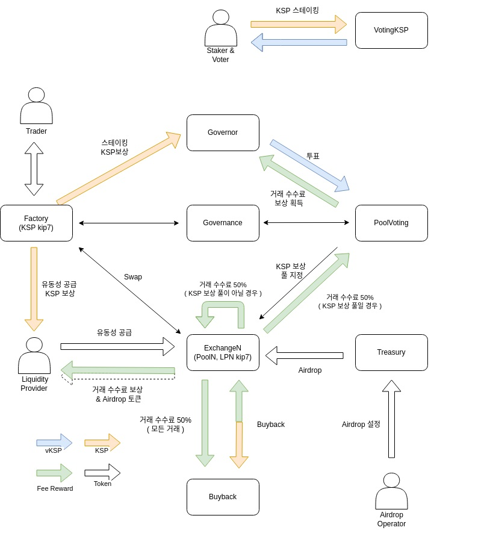

# 클레이 스왑 문서

> **KLAYswap**은 AMM(Automated Market-Making) 메커니즘과 유동성 풀로 동작하는 **스왑 프로토콜**로, KLAY 또는 KCT 유형의 토큰을 보유한 모든 사람이 유동성 공급자가 되어 거래 수수료로 수익을 얻을 수 있는 온체인 스왑 서비스입니다.

> AMM (Automated Market Maker) 프로토콜은 현재 DeFi (Decentralized Finance) 라는 탈중앙화 금융 시장을 일반 대중에게까지 알리게 한 결정적인 DEX 프로토콜입니다. AMM 이란 간단히 말해 기존의 매수/매도로 구성된 오더북을 유동성 공급자들에 의해 조성된 온체인 유동성 풀 (Liquidity Pool) 로 대체하여 토큰 간의 즉각적인 스왑을 지원하는 프로토콜입니다.

> AMM 기반의 덱스를 포함하여 전반적인 탈중앙화 금융 생태계를 활성화하기 위해서는 풍부한 유동성이 필요합니다. 이더리움의 대표적인 DeFi 프로토콜인 유니스왑 (Uniswap)의 경우 현재 약 USD 2.7 B 이상의 자산이 유동성 풀로 조성되어 있으며, 사용자들은 이 유동성을 기반으로 거래 활동을 합니다. 기존 이더리움 생태계의 DeFi 프로토콜에 비교하여 KLAYswap이 확실한 차별점을 가지며 실질적으로 사용될 수 있도록, 오지스는 오르빗 브릿지라는 체인 간 자산이 연계되어 이전의 탈중앙화 세계에서는 다루기 어려웠던 자산들의 페어와 유동성이 공급되는 환경을 일차적으로 구축했습니다. 오늘은 새롭게 구축된 클레이튼의 유동성 환경을 활용할 수 있는 DeFi 솔루션, KLAYswap을 여러분들께 소개드립니다.

> AMM은 기존 오더북 기반의 DEX에서 발전하여, 온체인상에서의 암호화폐 거래 방식을 변화시킨 혁신적인 거래 매커니즘입니다. 매수/매도 오더북을 대신하여 유동성 공급자들에 의해 조성된 유동성 풀을 통해 트레이더들은 자유롭게 거래할 수 있으며, 유동성 공급자들은 해당 유동성 풀에서 발생하는 거래수수료를 자신의 유동성 기여분에 맞춰 수익으로 공유 받을수 있습니다. 또한, KCT (Klaytn Compatible Token) 타입을 따르는 토큰을 보유하고 있는 보유자라면 누구든 유동성 공급자가 될 수 있습니다.

> KLAYswap의 AMM 메커니즘은 x\*y=k [ x= KLAY, y= KCT Token, k= Constant Function ] 공식을 바탕으로, 유동성 풀 생성시에 각 토큰의 수량에 따라 해당하는 토큰의 가격대가 형성됩니다. 예를 들어, x (KLAY) 의 유동성 공급량이 증가하면 상수 함수 k를 유지하기 위해 y (KCT 토큰)가 줄어듭니다. 이와 같은 방식으로 유동성 풀에서 토큰 별 공급 수량이 변화하며 가격이 형성되도록 설계되어 있습니다.

## 스왑 참여자 구분

> 거래자 : KLAYswap 풀에서 원하는 토큰을 거래할 수 있습니다. 거래 가격은 풀 내 예치된 두 자산의 수량(교환비율)에 따라 변동됩니다.

> 단일 예치자 : 한 개의 자산을 풀에 예치하고 해당 토큰의 예치 이자와 KSP 보상을 받을 수 있습니다. 단일 예치자는 풀(컨트랙트)에 자산 예치 시 공급 증표인 iToken을 지갑에 수령하게 되며, 풀 내에서의 내 iToken 지분율에 따라 각종 보상을 분배받습니다.

> 일반 페어 예치자 : 두 개의 자산을 풀에 예치하고 KSP보상, 추가 에어드랍 보상을 받을 수 있습니다. 일반 페어 예치자는 풀(컨트랙트)에 자산 예치 시 공급 증표인 LP (Liquidity Provider) Token을 지갑에 수령하게 되며, 풀 내에서의 LP Tokne 지분율에 따라 각종 보상을 분배받습니다.

> 플러스 페어 예치자 : 두 개의 자산 예치 시 내 자산과 함께 추가 자산(플러스 자산)을 투입하여 극대화된 KSP보상, 추가 에어드랍 보상을 받을 수 있습니다. 추가 예치하는 자산은 단일 풀에서 활용합니다. 풀(컨트랙트)에 자산 예치 시 일반 페어 예치와 동일하게 공급 증표인 LP (Liquidity Provider) Token을 지갑에 수령하게 되며, 풀 내에서의 LP Token 지분율에 따라 각종 보상을 분배받습니다.

> 스테이커 : 스테이커는 KSP를 스테이킹하고 KSP 인플레이션 보상을 받습니다. 장기간 스테이킹 할 수록 더 많은 vKSP(투표권)를 획득하며, 전체 프로토콜 vKSP에서 내 지분율에 따라 KSP 보상과 KLAYswap Drops를 통해 분배되는 다양한 토큰 에어드랍까지 획득할 수 있습니다.

> 풀 투표자 : KSP 스테이킹 후 획득한 vKSP(투표권)를 활용해 풀 투표에 참여하는 경우, 해당 풀에서 발생한 거래 수수료의 50%를 분배 받습니다

영구적 손실이란?

> AMM 기반 스왑 프로토콜에서는 거래 시점의 예상 가격과 실제 체결된 가격의 괴리 (슬리피지/Slippage)가 발생할 수 있습니다. 또한, 유동성 공급자는 공급 시점 이후에 해당 풀의 토큰 가격이 외부 가격과의 괴리가 발생하여 자동화된 마켓 메이킹 메커니즘에 의해 조정되는 과정에서 손실 (Impermanent Loss) 이 발생할 수 있습니다.

## 아키텍처

대표적인 컨트랙트 유형은 아래와 같습니다.

1. Factory Smart Contract
1. Exchange Smart Contract
1. Governance Smart Contract
1. VotingKSP Smart Contract
1. PoolVoting Smart Contract
1. Treasury Smart Contract
1. Distribution Smart Contract

아래와 같은 오딧 히스토리 기록을 가지고 있습니다.

## KSP 토큰 경제 모델

- Contract address : https://scope.klaytn.com/token/0xc6a2ad8cc6e4a7e08fc37cc5954be07d499e7654​

- Chain : Klaytn (Cypress)

> KSP는 클레이스왑 프로토콜 생태계를 유지하는 핵심 토큰으로, 인플레이션을 통해 유통되는 KSP보상은 단일, 페어(일반/플러스), 스테이킹 참여자에게 모두 분배됩니다.‌ KSP는 생태계 참여자에게 주어지는 보상으로, 클레이스왑 프로토콜에 더 많은 유동성을 확보하기 위한 강력한 인센티브 역할을 합니다.

> ‌인플레이션을 통한 KSP 유통을 매 2년 주기의 반감기를 통해 블록 당 분배 되는 수량을 감소 시켜 인플레이션을 둔화합니다.‌ 상세 인플레이계획은 KSP Allocation을 확인해주시기 바랍니다.

> KSP는 풀 예치, 스테이킹 등 생태계 기여를 통해 분배 받거나, 거래를 통해 획득할 수 있으며 다음과 같이 활용할 수 있습니다.‌

1. KSP를 단일예치, 페어예치, 플러스예치에 활용하여 인플레이션 보상을 분배 받을 수 있습니다.
1. KSP 스테이킹에 참여하여 KSP 인플레이션 보상을 분배 받을 수 있습니다.
1. KSP 보상 풀의 KSP 분배율을 결정하는 투표에 참여할 수 있습니다.
1. 프로토콜의 의제와 관련된 거버넌스 투표에 활용할 수 있습니다. (업데이트 예정)
1. 새로운 풀(페어)을 생성하는 비용으로 활용할 수 있습니다. (풀 생성 비용은 소각)

### KSP 분배율 자동화

> KLAYswap의 3개 생태계 참여자 중 특히 페어 예치에 대한 KSP 분배는 KSP 가치 상승 및 프로토콜 전체 성장과 직결된다는 점에서 매우 중요합니다. 더 많은 거래 수수료를 창출하는 건전한 페어에 더 많은 KSP를 분배해야만 KSP 소각량 증가를 통한 가치 상승이 가능하며, 다시 가치가 상승된 KSP 보상이 개별 페어의 유동성 공급자에게 분배됨으로써 개별 유동성 규모와 거래량 확대, 더 나아가 KLAYswap 전체 TVL의 확대에까지 이르는 시너지 효과를 얻을 수 있기 때문입니다.

> KLAYswap 거버넌스는 KSP 바이백 수량과 유저 풀 투표를 종합적으로 반영한 KSP 분배율 자동화 시스템을 통해 각 페어의 기여도와 성장 가능성에 대해 평가하여 KSP를 분배합니다. DAO는 투표를 통해 두 항목의 상세 반영 비율을 조정합니다.

**(1) KSP 바이백 수량 (50%)**

> KLAYswap과 KSP에 기여하는 바 가장 명확한 지표는 거래량이며, KSP 바이백 수량은 이를 객관적이고 지속적으로 측정할 수 있는 지표입니다. 스마트 컨트랙트가 각 페어에서 발생한 거래 수수료를 활용해 한 시간마다 자동으로 KSP를 바이백하며, 일별로 누적된 페어별 KSP 바이백 수량을 매일 1회 소각해 데일리 지표로 집계합니다. 단기/장기 지표를 모두 반영하기 위해 1일(15%), 7일(15%), 30일(20%) KSP 바이백 수량을 모두 반영합니다.

**(2) 유저 풀 투표 (50%)**
토큰에 대한 신뢰, 토큰 컨텐츠, 프로덕트의 미래 성장 가치 등 자동화 된 집계가 어려운 영역의 평가는 유저 풀 투표를 통해 보완합니다.

- () 괄호는 각 항목의 반영비율이며, 거버넌스 투표를 통해 변경될 수 있습니다.

#### 일반 자산의 거버넌스 투표 진행

KLAYswap거버넌스는 생태계 내의 유동성을 다음의 세 개로 분류 합니다. 이때 DAO는 일반자산 중 KSP 를 분배할 자산을 거버넌스 투표로 결정합니다. 한번 거버넌스를 통과한 일반 자산이더라도 3개월 마다 자격 유지 투표를 통해 DAO의 심사를 거칩니다.

(1) KSP
KLAYswap의 핵심 토큰으로, KSP와 결합된 유동성 페어의 활성화는 KSP의 일시적인 유통량 동결 효과를 얻을 수 있습니다.
KSP 페어는 KSP를 활용한 추가 수익의 기회까지 제공하여 KSP에 대한 추가 수요를 창출하여 가격 가치 안정화를 유도합니다.

(2) 대중적 자산 (A 레벨)
다수의 대형 거래소에서 지원되는 일정 시가총액 이상의 대형자산은 높은 자산 접근성, 대중 기반의 거대한 유동성과 홀더 커뮤니티를 보유하고 있습니다.
이를 KLAYswap 내부로 끌어들임으로써 해당 자산에 대한 대중의 거래 수요를 흡수해 막대한 거래량을 창출하고, KSP 소각을 통한 가치 상승과 신규 유동성의 유입을 유도합니다.
대중 자산의 홀더 커뮤니티를 대상으로 KLAYswap과 KSP를 노출하여, 대중기반의 강력한 시장 지배력을 형성합니다.

(3) 거버넌스 통과 자산 (B레벨)
일반 자산(C레벨)의 평가는 팀, 기술, 커뮤니티와 관련해 현재적 가치 판단이 어려운 영역으로, KLAYswap과 KSP의 강력한 지지자인 DAO의 판단(거버넌스 투표)을 통해 생태계 참여 여부를 결정합니다. 일반자산의 거버넌스 통과 정책은 아래 페이지를 참고해주세요.

#### KSP 토큰 분배

1. 총 발행량 : 126,144,000 KSP
1. 시작 물량 \* : 0 KSP
1. KSP 일 채굴량\*\*: 86,400개 (63,072,000 블록 (약 2년) 동안 블록 당 1개 씩 채굴)
1. 반감기\*\*\*: 유동성 채굴 프로그램 (Liqudity Mining Program) 시작 후 매 63,072,000 블록 마다 일일 채굴량이 절반으로 줄어듭니다.
1. 개발 및 안정화 커미션 \*\*\*\* : 채굴량 중 15% (첫 2년 간 지속 후 채굴량에 대한 커미션은 사라짐, 총발행량 기준 7.5%)

> 초기 KSP 공급을 0으로 설정하면 초기 사용자가 자유롭게 성장하고 체계적인 결정을 내릴 수 있는 동등한 기회를 갖게 됩니다. 처음부터 KSP는 각 Genesis 블록에서 유동성 채굴을 통해서만 분배되며, 보상으로 KLAYswap 유동성 공급자에게 분배됩니다.

## 토큰 스왑

> 토큰 스왑은 풀에 예치된 토큰 쌍의 비율에 따라 클레이튼 체인상에서 유통되는 다양한 KIP7 토큰을 교환할 수 있는 가장 간단한 방법입니다.

> 클레이스왑의 풀을 통해 토큰을 교환(거래) 하는 경우, 각 풀별 수수료 정책에따라 수수료가 발생합니다.

## 컨트랙트

전체 컨트랙트 개요 및 event, read-only, state-chainging 함수는 [여기](https://docs.klayswap.com/v/kr/developer/contract/factory)에서 확인하세요.

**Factory**

> The Factory smart contract oversees the full functionality of token pair registration and transactions in KLAYswap. It is also a token contract for KLAYswap's KSP governance token that complies with the KIP7 standard, and a smart contract that implements all functions related to KSP mining.

**Exchange**

> This is a smart contract to expand KIP7 that is created with every liquidity pair. The Factory deploys this as new pool creation is requested. Although the Factory actually stores the two tokens of a pair and swapping takes place through it, the Exchange Contract must be called for liquidity to be provided or taken.

**PoolVoting**

> 이 컨트랙트는 최대 투표 가능한 풀 수 (10개), 풀 전체의 투표 정보, 풀 투표 순위 등 KLAYswap의 유동성 풀 투표를 관리합니다. 풀 투표자에 대한 보상으로 풀 거래 수수료의 50%를 보유한 투표 지분에 따라 분배합니다.

**VotingKSP**

> 이 컨트랙트는 KSP를 스테이킹과 관련된 생태계 동작을 담당합니다. 스테이킹 수량과 기간에 따라 투표권(vKSP)을 발행하며, 스테이킹 참여자에게 1일 KSP 마이닝 수량의 40%를 분배합니다.
> (스테이킹 참여자 대상 KSP 분배율은 거버넌스 투표를 통해 변경될 수 있습니다)

**Treasury**

> Treasury Contract는 에어드랍 실행을 주관하는 컨트랙트입니다. 권한을 가진 Operator는 Treasury Contract를 통하여 에어드랍을 설정하고 집행할 수 있습니다.

**Distribution**

> 풀에 적용된 Airdrop 계획 컨트랙트입니다. 한 개의 유동성 풀과 한 개의 토큰을 타겟으로 할 수 있습니다. 해당 컨트랙트는 권한이 있는 Operator가 Treasury 를 통해 계약을 집행하게 됩니다.

**Governor**

> 이 컨트랙트는 클레이스왑의 투표 등록, 투표 집계, 집행을 관리하는 관리자 기능을 합니다. 또한 클레이스왑의 중요 파라미터들과 제안 등록, 투표 집행을 수행합니다.

**SinglePool**

> 이 컨트랙트는 단일풀 컨트랙트로써 유동성 제공자는 자산을 예치/출금하고 플러스풀 사용자는 활용자산을 단일풀에서 가져오거나 반환하게 됩니다.

**SinglePool Factory**

> 이 컨트랙트는 단일풀 생성/관리 컨트랙트로써 유동성 제공자는 자산을 예치/출금하고 플러스풀 사용자는 활용자산을 단일풀에서 가져오거나 반환하게 됩니다.

**Store**

> 이 컨트랙트는 LP가 보유한 Token의 수량과 시간 가중치가 반영된 가격 정보를 갖고 있습니다. 보유한 priceACumulativeLast, priceBCumulativeLast는 TWCP(Time-Weighted Cumulative Price) 으로써 시간 가중치가 반영된 가격 정보입니다. 이 컨트랙트의 수량과 가격 정보는 Price Oracle 에 쓰이게 됩니다.

**Helper**

해당 컨트랙트는 두 개의 토큰을 가져오지 않더라도, 하나의 토큰으로 풀에 예치할 수 도록 도와주는 기능을 제공하는 컨트랙트 입니다.

## 레퍼런스

- [Klayswap](https://docs.klayswap.com/v/kr)
