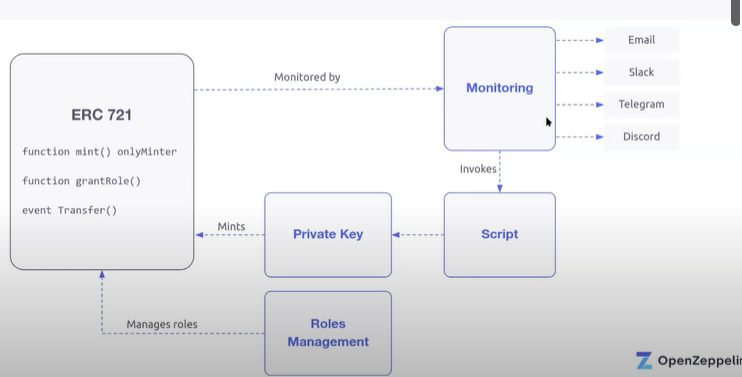
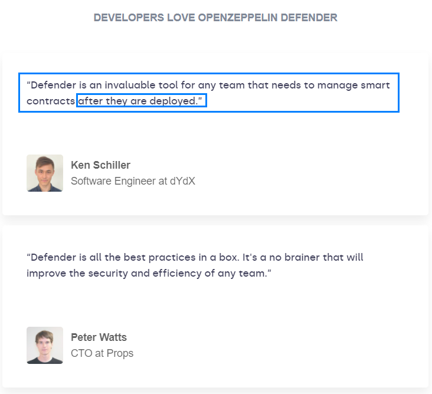

# Learning Defender essentials

- [Openzeppelin: Defender-client monorepo](https://github.com/developerasun/defender-client/tree/master)

> OpenZeppelin Defender provides a security operations (SecOps) platform for Ethereum with built-in best practices. Development teams implement Defender to ship faster and minimize security risks.

How Defender works

Workflow

1. delegate your contract transaction previlege to Defender Relay.
1. automate the trasaction using Defender Autotask
1. enable admin previlege(e.g. access control) to Defender Admin by creating admin actions
1. monitor the contract using Defender Sentinel and connect it with collab tools like Slack

## Get started

> Defender is free! Just head over to defender.openzeppelin.com, hit Sign In, and choose to create a new account. After verifying your email address, you will be redirected to your own Defender account. See below for how to invite more users to your team!

## Components

> Automate your Ethereum operations to deliver high-quality products faster with lower risk to users. Learn more about each component by clicking on its card.

1. admin : Automate and secure all your smart contract administration.

> Administration mistakes on protocols and applications put user funds at risk. With Defender Admin, you can seamlessly **manage all smart contract administration including access controls, upgrades, and pausing**. Works with popular multi-sigs including Gnosis Safe.

1. relay : Build with private and secure transaction infrastructure

> Don’t spend time implementing third-party or homegrown transaction infrastructure that is unreliable or insecure. Use Defender Relay to quickly implement private relayers with support for testnets, mainnet, layer 2 and sidechains. **Increase user security with embedded key vaults, API key management, and meta-transactions**.

1. Create automated scripts to call your smart contracts

> Homegrown bots and cron jobs are tedious to maintain and a target for hackers. With Defender Autotasks, you can easily create and run scripts **in a serverless environment** that call your smart contracts and other web services. **Automate your operations and lower attack risk**.

1. sentinels : Monitor and respond to smart contract exploits

> Use **Defender Sentinels to automatically monitor and respond to events, functions, and transaction parameters on your smart contracts**. With full Autotask integration, you can add circuit breakers or automated actions so your team can respond to attacks within seconds and receive notifications via email, Slack, Telegram, or Discord.

1. advisor : Quickly implement security best practices

> Protocol complexity is increasing, leading to new vulnerabilities that you might not be aware of. Use **Defender Advisor knowledgebase to stay up to date with the latest security best practices**. Use step-by-step guides to implement them across development, testing, monitoring and operations.

